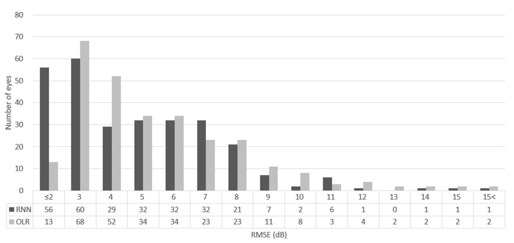
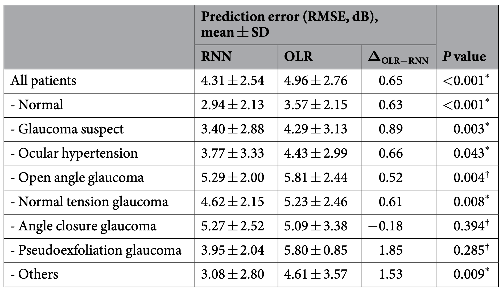
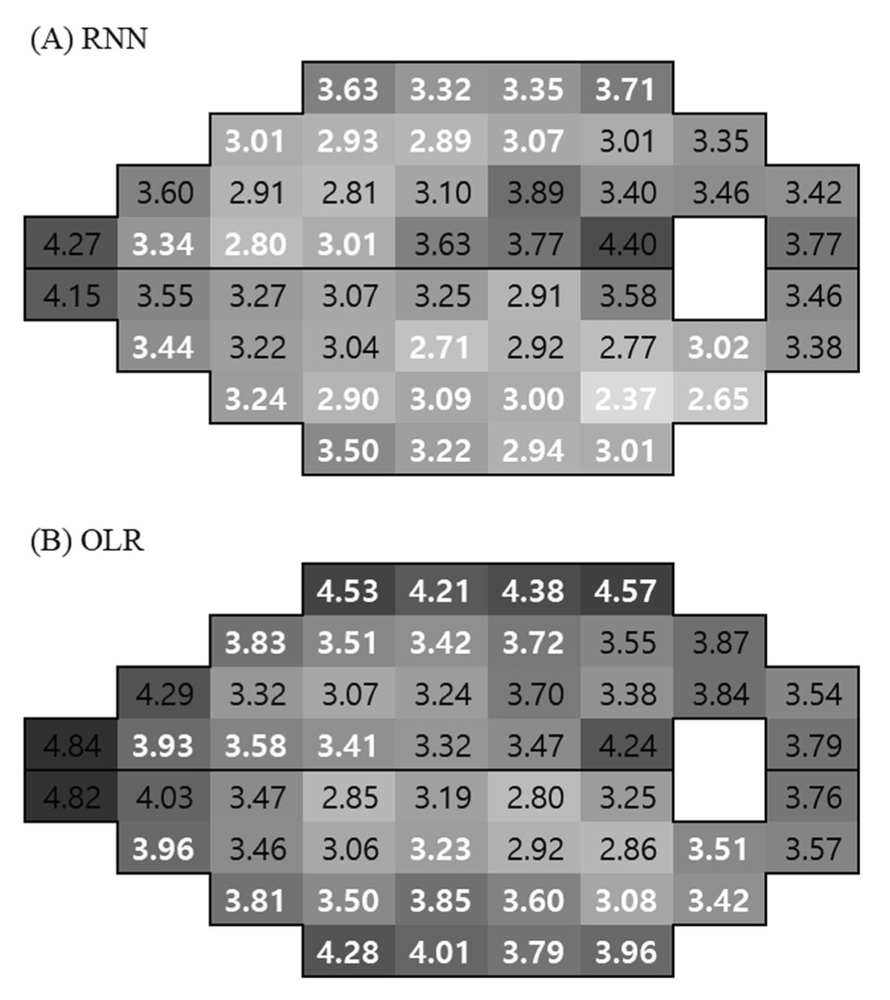
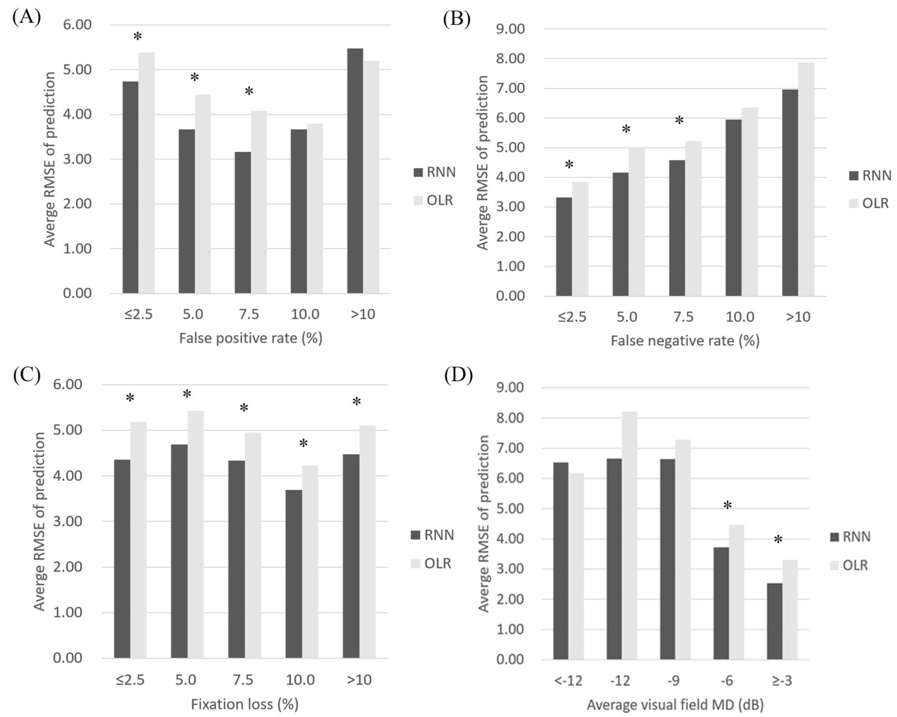

# Visual Field prediction using Recurrent Neural Network

Park, K., Kim, J., & Lee, J. (2019). Visual Field Prediction using Recurrent Neural Network. *Scientific Reports*, *9*(1), 1–12. https://doi.org/10.1038/s41598-019-44852-6

## Introduction

녹내장은 주요 실명 원인 중 하나이다. 이것을 예방하기 위해 시각장(visual field) 검사를 모니터링하고 진행 상황을 확인하는 것이 도움이 되지만, 시각장 진행에 대한 적절한 해석은 어렵다. 시간에 따른 시각장 진행 패턴은 환자마다 상당히 다르다. 

시각장 예측에 대한 선행 연구는 다음과 같다. 

- (1995) Modelling series of visual fields to detect progression in normal-tension glaucoma
  - 곡선 적합 모델을 비교, 미래의 시각장 상태를 예측할 수 있는 가능성이 있음(?)
- (2012) Visual Field Progression in Glaucoma: Estimating the Overall Significance of Deterioration with Permutation Analyses of Pointwise Linear Regression (PoPLR)
  - linear regression 모델이 미래의 시각장 예측에 적합함을 보임
- (2011) A method to measure and predict rates of regional visual field decay in glaucoma
  - linear, quadratic, and exponential 모델들을 비교, exponential 모델이 가장 적합
- (2014) A new approach to measure visual field progression in glaucoma patients using variational Bayes linear regression
  - 머신러닝 알고리즘의 일종인 variational Bayes linear regression(VBLR)을 사용, 우수한 성능을 입증했다고 보고

최근에는 머신러닝에서 더 나아가 딥러닝으로 더 좋은 퍼포먼스를 구현이 가능하다. recurrent neural network(RNN)은 Convolutional Neural Networks(CNN)과 더불어 각광받고 있는 알고리즘이다. RNN의 경우 신경망 내에 입력 데이터를 유지하므로 과거 입력을 고려하여 결과값을 예측한다. 본 논문에서는 RNN을 이용하여 시각장의 진행 사항을 예측하고, 이를 linear regression과 비교하였다. 

*Question.* 딥러닝을 사용한 시각장 예측은 최초인가, RNN 사용은 최초라고 논문에서 언급되었다. 딥러닝의 다른 기법을 사용한 선행연구는 없는가, Discussion에서 딥러닝이 녹내장 연구에 활용은 되고 있으나 분류에 국한되어있다고 서술되어 있다. RNN이 아닌 딥러닝을 사용한 질병 예측을 목적으로 하는 선행 연구는 없는가

## Methods

#### Data

최소 6회 이상 연속적인 시각장 검사를 받은 피실험자 841명의 안구 1408안으로 훈련데이터가 구성된다. (양쪽 눈을 고려했을 것이며, 품질에 따른 데이터 선별이 있었을 것으로 추정) 데이터에 대한 보다 자세한 설명은 논문의 Table1에 서술되어 있으나, 아직 크게 의미는 없을 것으로 생각된다. 훈련데이터는 질병에 대한 라벨링이 되어있지 않다. 질병이 시각장 예측에 영향을 줄 수 있다고 판단 하였다. 훈련데이터는 10겹 교차 검증을 시행한다. 

검증데이터는 별도로 281명의 안구 281안으로 구성된다. 데이터에 대한 자세한 설명은 Table2에 서술되어 있으나, 마찬가지로 아직 크게 의미 없다. 훈련데이터와 검증데이터의 피실험자는 중복되지 않는다. 검증 그룹의 피실험자에 대한 안과 검진을 시행하였고 (아마 약간의 치료를 진행한 것으로 파악됨) 녹내장과 정상을 논문에서 나름의 기준으로 정의하였다. (안과 질환 이력이 없는 등의 기준이며 자세한 내용은 논문을 참고할것이나 큰 의미는 없음)

#### Visual field examination

데이터의 field size(=10 or 24)에 따른 각도(=10 or 30)가 차이가 있다. 이를 두고 10-2, 24-2, 30-2로 표현하는 듯 하다. 논문은 24-2를 사용하였고, 이 경우 54개 포인트에서 2개가 제외된 52개 포인트를 이용한다. 

*Question.* 10-2, 24-2, 30-2 숫자의 의미는 정확히 무엇인가, Discussion 파트에서는 24-1도 언급한다. 

거짓 양성, 거짓음성, 고정 손실 모두 33% 미만으로 정의되었다. 정상에 대해서는 GHT, MD, PSD가 정상 모집단의 95% 이내에 있는 대상으로 정의하였고, 녹내장은 GHT가 Outside Normal Limits 이거나 PSD가 95% 벗어난 경우로 정의하였다.(MD에 대한 언급은 없음)

> - False Positive : 번쩍하지 않았는데 버튼을 누른 경우 (실제 음성인데 양성으로 판정)
>
> - False Negative : 번쩍했는데 버튼을 누르지 않은 경우 (실제 양성인데 음성으로 판정)
>
> - Fixation Loss : 가운데를 얼마나 잘 보고있어나를 보여주는 지표
>
>   위의 수치들이 높으면 검사를 잘못한것
>
> GHT는 다음의 세가지 경우가 있다. 
>
> - Within normal limit : 정상
> - Borderline : 의심
> - Outside normal limit : 이상
>
> VFI : 0%는 실명으로 0에 가까울수록 좋지 않다.
>
> MD : 음수값이 클수록 좋지 않다.
>
> PSD : <5%아래로 나오면 좋지 않다.
>
> https://blog.naver.com/seeyou_eye/221772316931

#### Artificial neural network

컴퓨터 사양 및 패키지 버전에 대한 설명이 언급되어있다. 파이썬은 3.5를 사용하였다.

입력 데이터 및 조건들을 나열하였고, 특히 시간에 대한 입력 값을 설정하여 특정 시간(예측하고자 하는 미래지점)을 예측한다. 자세한 내용은 추가적인 공부후에 읽어보자. 6번까지 검사를 했던 케이스가 충분하지 않았기 때문에 데이터 수집 이후 추가적인 연구를 계획하고 있다. (이것이 우리가 해야 할 일인가)

#### Statistical analysis

선행연구에서 사용한 사례를 근거로 예측성능을 비교하기 위해 Total Deviation Values(TDV)의 Root Mean Square Error(RMSE)와 Mean Absolute Error(MAE)를 정확도 지표로 사용하였다. RNN과 LR의 RMSE와 MAE를 계산하여 유의한 차이를 평가하기 위해 paired t-test 와 Wilcoxon's signed-rank test를 진행하였다. 

## Results

RNN과 LR의 RMSE(단위 dB)를 RMSE를 기준으로 나타내면 아래의 표와 같다. 

RNN에서 RMSE$\leq3$dB의 경우는 전체의 41.4%이고 LR에서 2dB$\leq$RMSE$\leq4$dB의 경우가 42.7%이다. 질병에 대한 예측도 Table3에 요약되어 있다. (한가지 질병을 제외하고 전부 RNN의 RMSE이 낮음)

*Question.* 논문 내용 중 `With the exceptions of angle-closure glaucoma and pseudoexfoliation glaucoma, the prediction RMSE of RNN was significantly better than OLR in all diseases.` pseudoexfoliation glaucoma는 Table3에서 가장 좋은 결과값인데 왜 제외하는가 : p-value가 높아서

*Question* 왜 pseudoexfoliation glaucoma만 그러한가, t-test와 wilcoxon의 검증 중 좋은 결과만 Table3 서술하였을텐데 다른 결과는 어떠한가

RNN과 LR에 대한 MAE는 위의 그림과 같다. RNN이 전체적으로 더 엹은 색상을 띈다. 흰색 숫자는 RNN의 수치가 낮으면서 유의하게 다른 지점을 표시하였다. 그리고 녹내장에 관련한 포인트가 흰색 숫자에 대거 포함되어 있다. 

FP, FN 등 다양한 요인과 RMSE의 평균에 대한 상관관계를 살펴보고자 한다.

FP가 증가함에 따라 RNN과 LR 차이는 작아지고 결국 역전되지만 유의미하지는 않다. FN과 FL의 경우 모두 RNN이 LR보다 결과가 좋다. MD의 경우 숫자가 클수록 좋은 것이기 때문에 -12이하를 제외하고 전부 RNN이 낮게 나온것은 좋은 결과이다.  

Figure6은 RMSE의 평균이 아닌 각 데이터마다의 직접적인 값을 나타내었다. 이를 통해 FL와 FP에 대해서는 상관관계가 없거나 약하다는 것이 논문의 결론이다. 

*Question.* 논문에서 사용한 데이터를 문의하자. 

*Question.* 당장의 목적은 이것을 똑같이 구현하는 것인가

